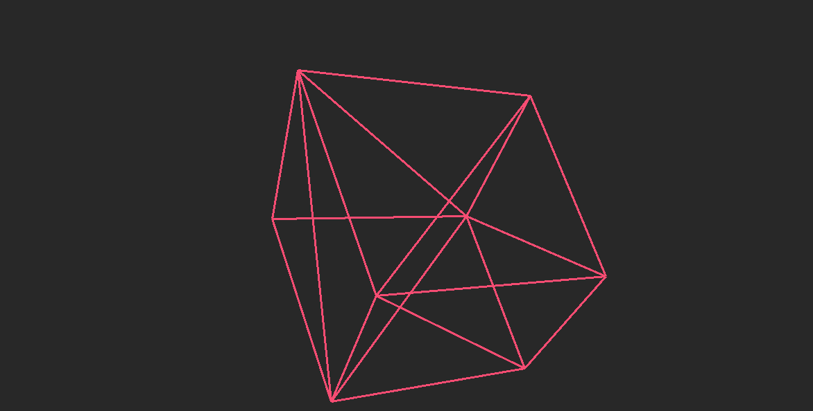

# poli-renderer
A software rasterizer I'm building to understand the foundations of software rendering.
 Obviously just a toy implementation, I wouldn't recommend using a python renderer in production.

 I plan on improving this basic version with additional features like triangle rasterization and realistic lighting.

